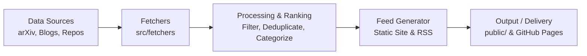

# AI in Mathematics Daily Feed

An automated daily intelligence digest aggregating recent papers, tools, benchmarks, and discussions at the intersection of **Artificial Intelligence and Mathematics**.

Topics covered include:
- **Formal Verification & Interactive Theorem Proving** (Lean 4, Isabelle/HOL, Coq)
- **Neural & Automated Theorem Proving (ATP / ITP)**
- **Mathematical Reasoning & Large Language Models**
- **Autoformalization and Proof Generation**
- **Computer Algebra Systems & Symbolic Computation with Machine Learning**

---

## Architecture Overview

The system runs on a lightweight, modular pipeline designed to be scheduled via GitHub Actions:



### Directory Structure

```
math-ai-daily-feed/
├── .github/
│   └── workflows/        # GitHub Actions workflows for automated daily runs
├── public/               # Generated static site, RSS feeds, and markdown archives
├── src/
│   └── fetchers/         # Data retrieval modules (arXiv API, semantic search, feeds)
├── tests/                # Test suite (unit and integration tests)
├── .gitignore            # Git ignore patterns for Python, OS, and env files
├── requirements.txt      # Project dependencies (requests, pytest)
└── README.md             # Project documentation and architecture overview
```

### Components

1. **Fetchers (`src/fetchers/`)**: Modular scrapers and API clients for pulling data from arXiv categories (`math.LO`, `cs.AI`, `cs.LO`), research blogs, and community feeds.
2. **Feed Generation & Storage (`public/`)**: Generates machine-readable (JSON, RSS/Atom) and human-readable daily digest summaries published as static assets.
3. **Automated Pipelines (`.github/workflows/`)**: Scheduled cron workflows running daily to execute fetchers, process updates, and deploy output to GitHub Pages.
4. **Testing & Quality Assurance (`tests/`)**: Pytest-based automated tests ensuring parser robustness, fetcher rate-limiting compliance, and schema validation.

---

## Getting Started

### Prerequisites

- Python 3.10 or higher
- `pip`
- Git

### Setup

1. Clone the repository:
   ```bash
   git clone https://github.com/tryggth/math-ai-daily-feed.git
   cd math-ai-daily-feed
   ```

2. Create and activate a virtual environment:
   ```bash
   python3 -m venv .venv
   source .venv/bin/activate
   ```

3. Install dependencies:
   ```bash
   pip install -r requirements.txt
   ```

### Running Tests

Execute the test suite using `pytest`:

```bash
pytest
```

---

## License

MIT License
